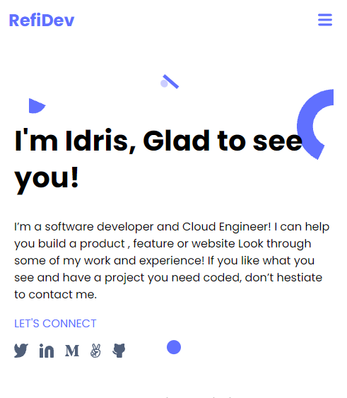

# Professional Portfolio

> This is my Professional Portfolio check it out to get my details.



Additional description about the project and its features.

## Built With

- Html
- CSS
- Deploy with Netlify

## Live Demo

[Live Demo Link](https://livedemo.com)

### Development (Running locally)

- Clone the project

```bash
git clone https://github.com/Idris01/professional-portfolio.git

```

- Install Dependencies

```bash
npm install
```

To run StyleLint by itself, you may run the lint task:

```bash
npm run lint:check
```

Or to automatically fix issues found (where possible):

```bash
npm run lint
```

You can also check against Prettier:

```bash
npm run format:check
```

and to have it actually fix (to the best of its ability) any format issues, run:

```bash
npm run format
```

You can also check against HTML Validator:

```bash
npm run html-validator
```

## Style Guides

- [CSS Style Guide](http://udacity.github.io/frontend-nanodegree-styleguide/css.html)
- [HTML Style Guide](http://udacity.github.io/frontend-nanodegree-styleguide/index.html)
- [JavaScript Style Guide](http://udacity.github.io/frontend-nanodegree-styleguide/javascript.html)
- [Git Style Guide](https://udacity.github.io/git-styleguide/)

## 👤 Author

- Github: [@Idris Adebowale](https://github.com/idris01)
- Twitter: [@Idris Adebowale](https://twitter.com/author)
- Linkedin: [@Idris Adebowale](https://www.linkedin.com/in/idris-adebowale-ab4208ab/)

## 🤝 Contributing

Contributions, issues and feature requests are welcome!

Feel free to check the [issues page](../../issues).

## Show your support

Give a ⭐️ if you like this project!

## Acknowledgments

- https://github.com/adejam/html-and-css-templates

## 📝 License

[MIT licensed](./LICENSE).
